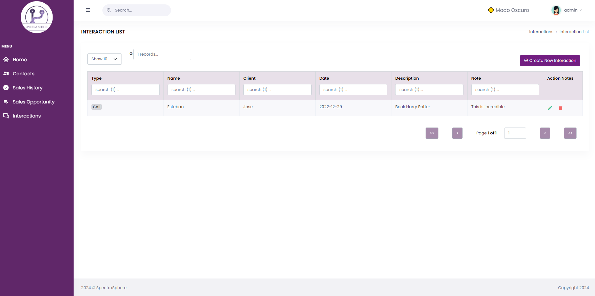
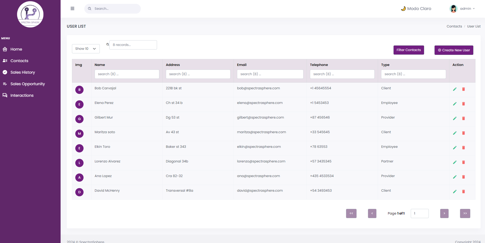

# SpectraSphere CRM

SpectraSphere is a CRM project tailored for the digital entertainment industry, providing a centralized platform for effective customer relationship management. It enables users to store detailed contact information, track interactions such as sales opportunities and meetings, and streamline sales processes. SpectraSphere aims to empower companies in the digital entertainment sector to excel in a competitive market by offering tools to manage and nurture successful customer relationships.

## Table of Contents
1. Introduction
2. Screenshots
3. How to install
4. Technologies Used
5. Resources
6. Authors


## Introduction
SpectraSphere is a comprehensive solution designed for the digital entertainment sector, aimed at effectively managing customer relationships. This CRM provides a centralized platform that allows users to store detailed contact information and record key interactions, such as sales opportunities, meetings, and more.

Contact management is one of the fundamental pillars of SpectraSphere. Users can store comprehensive information about contacts in an organized manner, including names, email addresses, phone numbers, and more. This facilitates tracking of customer relationships and allows for greater customization in interactions.

One of the standout features of SpectraSphere is its ability to record all interactions with customers, such as meetings and events. This provides a comprehensive view of past and future interactions, enabling more effective and personalized customer service.

In addition to contact management and interactions, SpectraSphere facilitates sales opportunity tracking. This functionality helps maintain an orderly tracking of business opportunities and maximizes conversion possibilities.

Ultimately, SpectraSphere emerges as an indispensable tool for companies in the digital entertainment sector looking to stand out in an increasingly competitive market, by offering them the necessary tools to manage and cultivate successful relationships with their customers.


## Screenshots

On the CRM site, you can view an intuitive interface.


You will be able to manage not only your interactions with customers.


but also your contacts and sales opportunities.



## How to install

- Open the Git Bash console.
- Use the `cd` command to navigate to your desktop and press enter.
```bash
  $ cd Desktop/
```
- Copy and paste the following command to clone the repository from GitHub: `git clone https://github.com/AndresVilladaPoli/CRM_Entertainment.git`

- Navigate to the frontend directory within the cloned directory.
```bash
  $ cd frontend/
```
- Run the `npm install` command to install Node.js dependencies
```bash
  $ npm install
```
- Then, run `npm start` command to start the frontend
```bash
  $ npm start
```
### How to Install The Backend of the project

- First of all, you need to have jdk 17 version. We recommend using Microsoft Visual Studio Code as your IDE.
- Then, within Visual Studio Code, you need to download the following Spring Boot extensions:
	- Spring initializr 
	- Spring Boot dashboard 
	- Spring boot tools 
	- Spring Boot Extensión pack


   Also, it is recommended to have the Live Server extension 
   
   
   
   - Now, we must download MySQL Workbench to create our database
	- We need to create a new connection, preferably called with a name alluding to the project and with the other default values
	
	
   - the localhost user must be "root" (default user) and must not have a password
   - then, Inside the new connection, we must create a new Schema called spectradb
  
  

If you want to add a password or change the user, you can do so by going to backend\src\main\resources and editing the 'applicationProperties' file


To initialize the 'backend' of the project, we need to go to the BackendApplication file (located in backend\src\main\java\com\CRM_Entertainment\backend) and run


## Development Approach

We followed the agil methodologies for coding. For the frontend development, we utilized React.js framework, while for the backend, Spring Boot was employed. Additionally, Visual Studio Code was the IDE used for development.


## Resources
We utilized the following resources throughout the project
- [Bootstrap icons](https://icons.getbootstrap.com)
- [Font Awesome](https://fontawesome.com)
- [Font Squirrel](https://www.fontsquirrel.com)
- [Google Fonts API](https://fonts.google.com)

## Authors ✒️

- [Andrea Alvarez Posada](https://github.com/andreaalpo)
- [Dayron Restrepo Perez](https://github.com/DayronR12)
- [Mateo Echeverri Jiménez](https://github.com/Mateo8888)
- [Andrés Ricardo Villada Marín](https://github.com/AndresVilladaPoli)
